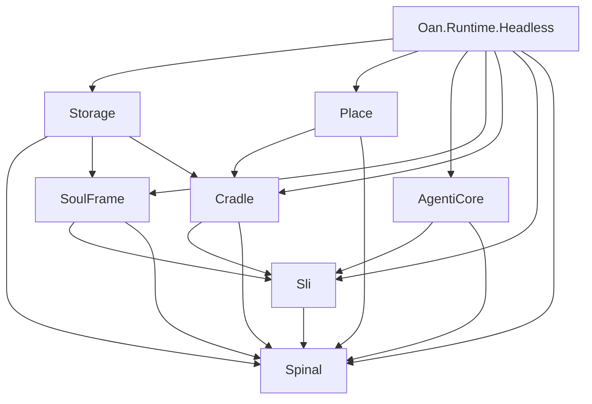

# v1.0 Migration Policy (Staged)

## 1. Core Constraint
No code may be migrated from `v0.1-freeze` to `v1.0` if it requires "adapter shims" or violates the new strict dependency graph. Always prefer new code to copy-paste old code. 

## 2. Dependency Graph

## 3. Migration Status

### Migrated (Clean)
- Basic Primitives (Hashing, Serialization)
- Engram Envelope Structure
- Authoritative Enums (SatFlightPhase, SliStage)
- Initial NDJSON Storage Logic

### Deferred (Archive Only)
- **GEL/GoA/OAN Modules**: Business logic is too tightly coupled to v0.1 stubs. Requires rewrite to target `Oan.Place` abstractions.
- **Atlas Masking**: Linguistic logic needs decoupling from Unity-era string handling.
- **Lisp Pipeline**: Only interfaces should be ported; implementation awaits v1.0 Spinal stability.
- **HITL Interrupts**: Requires new Async signaling in `Oan.Cradle`.

## 4. Porting Process
1. Identify a component in `v0.1-freeze`.
2. Map its dependencies to v1.0 projects.
3. If dependencies are missing or circular, REFACTOR the v0.1 code before porting OR defer.
4. If dependencies align, copy class into corresponding `v1.0/src/[Project]` and update namespace.
