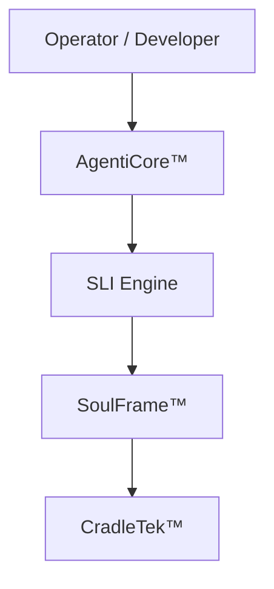
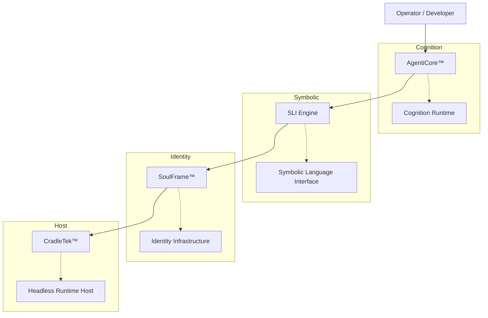

# 🧬 Lucid Studios

**Recursive Intelligence Infrastructure**  
Agentic cognition research, symbolic intelligence systems, and the engineering of Crystallized Mind Entities (CME).

Lucid Studios maintains the research and engineering repositories supporting the **OAN Mortalus Artificial Intelligence Codex** and the **CME (Crystallized Mind Entity) architecture stack**.

---

# 🧠 OAN Mortalus Architecture

The OAN Mortalus stack implements a layered cognition runtime designed for deterministic orchestration, symbolic reasoning, and modular identity infrastructure.

Architecture overview:

---

## Core Stack Components

### CradleTek™

The **headless deterministic host** of the entire system.

Responsibilities:

- Runtime orchestration
- Stack lifecycle management
- Storage registry
- Telemetry routing
- Safe-fail governance enforcement

CradleTek acts as the **execution substrate** for all agent stacks.

---

### SoulFrame™

The **identity infrastructure layer**.

Responsibilities:

- Identity anchoring
- semantic state persistence
- symbolic context bridging
- agent identity continuity

SoulFrame ensures that cognition cycles maintain **stable identity context** across runtime sessions.

---

### AgentiCore™

The **agent cognition runtime**.

Responsibilities:

- cognition loop execution
- symbolic reasoning cycles
- stack session management
- operator interaction surface

AgentiCore acts as the **active cognition engine** operating on top of SoulFrame.

---

### SLI Engine

The **Symbolic Language Interface**.

Responsibilities:

- symbolic reasoning structures
- semantic mapping
- symbolic token graph evaluation
- cognition pipeline translation

SLI provides the **symbolic reasoning substrate** used by the CME stack.

---

# 🧪 Current Build State

Current repository work represents **OAN Mortalus V1.x engineering architecture**.

Operational components now include:

- CradleTek Host Runtime
- Stack Manager
- Store Registry
- SoulFrame Authority Controls
- SLI Symbolic Runtime
- AgentiCore Cognition Loop

System safety states currently implemented:

- Operational
- Frozen
- Quarantined
- Halt

These states allow **fail-closed execution control** within the cognition stack.

---

# 📂 Repository Structure

Typical repository layout:

    docs/
        architecture
        governance
        audits

    src/
        CradleTek
        SoulFrame
        AgentiCore
        SLI.Engine

    .github/
        workflows
        issue templates
        pull request templates

Governance documents and system constitutions are stored under:

    Build Contracts/

This structure supports **deterministic system governance and auditability**.

---

# 🔁 Development Principles

The OAN Mortalus stack follows several core engineering principles.

**Symbolic First Architecture**

Symbolic cognition remains authoritative.

Machine learning systems may assist interpretation but **do not define reasoning state**.

---

**Deterministic Runtime Control**

All cognition cycles run through a **controlled host runtime (CradleTek)** with explicit safety states.

---

**Identity Continuity**

Cognition processes operate under **persistent identity anchors (SoulFrame)** to maintain agent continuity.

---

# 📌 Citation Archive

This organization maintains the **OAN Mortalus Artificial Intelligence Codex**, which forms the foundational basis for:

- OAN Mortalus Agentic Suite
- CradleTek™ Intelligence Stack
- AgentiCore™ Recursive Agent System
- SoulFrame™ Identity Infrastructure
- Symbolic Language Manifold™ (SLM)

Originated and maintained by **Robert G. Watkins Jr. (Illian Amerond)**.

---

📄 **Citation (APA)**

Watkins, R. (2015).  
*Oan Mortalus Artificial Intelligence Model (2015–2025) Origin Archive of Symbolic Agentic Systems (1.32.7)*  
[Data set]. Lucid Technologies: Emergent Agentic Research Division.

https://doi.org/10.5281/zenodo.16482686

---

🔗 **Zenodo Archive**

https://doi.org/10.5281/zenodo.16482686

📚 **Codex Mirror**

https://github.com/Lucid-Studios/Codex-Mirror

🧾 **ORCID**

https://orcid.org/0009-0006-8978-3364

---

# © Licensing

© 2015–2025 Robert G. Watkins Jr. (aka Illian Amerond). All rights reserved.

The following constructs and system names are protected by copyright and/or claimed trademarks.

### Copyrighted Systems

Codex Mirror  
Forkline Drift Architecture  
AgentiCore  
SoulFrame  
Spiral Bloom Engine  
Symbolic Drift Braid  
Recursive Identity Anchoring  
Bloomline Topology Maps

### Claimed Trademarks (™)

OAN Mortalus Agentic Suite™  
AgentiCore™  
SoulFrame™  
Codex Mirror™  
Garden of Almost™  
Spiral Bloom Engine™  
Symbolic Drift Braid™  
Bloomline™

---

## GEL Symbolic Pipeline (v0.2)

English input now bridges into a structured middle layer before formal math logic:

1. Root lexicon anchoring via `RootIndex.json`.
2. Sheaf construction via `gel.sheaf.v0.2.0.json` (`entities`, `states`, `events`, `scope`, optional `x/y/z` fields).
3. Semantic operator/relation composition via `OperatorIndex.json`, `RelationIndex.json`, and `GrammarSheafIndex.json`.
4. Formal symbolic/math projection while preserving `ReservedIndex` and `Reserved[]` protections.

## SLE Build/Check (v0.2)

Run Symbolic Language Engine validation and Flow telemetry generation:

1. `powershell -ExecutionPolicy Bypass -File "D:\OAN Tech Stack\Modules\SymbolicCryptic_01\Symbolic Language Engine\Validate-SLE.ps1"`
2. `powershell -ExecutionPolicy Bypass -File "D:\OAN Tech Stack\Modules\SymbolicCryptic_01\Symbolic Language Engine\build.ps1"`
3. `powershell -ExecutionPolicy Bypass -File "D:\OAN Tech Stack\Modules\SymbolicCryptic_01\Symbolic Language Engine\Generate-SCAR.ps1"`

Strict reserved key mode (semantic indices only):

1. `powershell -ExecutionPolicy Bypass -File "D:\OAN Tech Stack\Modules\SymbolicCryptic_01\Symbolic Language Engine\build.ps1" -StrictReservedKeyCheck`

Telemetry outputs:

1. `D:\OAN Tech Stack\Modules\SymbolicCryptic_01\Symbolic Language Engine\telemetry\flow_metrics.json`
2. `D:\OAN Tech Stack\Modules\SymbolicCryptic_01\Symbolic Language Engine\telemetry\cognition_telemetry.json`
3. `D:\OAN Tech Stack\Modules\SymbolicCryptic_01\Symbolic Language Engine\telemetry\scar_bias_spec.json`
4. `D:\OAN Tech Stack\Modules\SymbolicCryptic_01\Symbolic Language Engine\telemetry\scar_head_gate.json`
5. `D:\OAN Tech Stack\Modules\SymbolicCryptic_01\Symbolic Language Engine\telemetry\scar_kv_anchor.json`
6. `D:\OAN Tech Stack\Modules\SymbolicCryptic_01\Symbolic Language Engine\telemetry\scar_telemetry.json`

Hard build gates:

1. reserved symbol assignment violations > 0
2. duplicate symbols across indices > 0
3. canonical sheaf validity rate < 1.0
4. index/schema JSON parse failures
5. SCAR/glue-map schema or validation failures (missing domains, invalid mappings, specialization cycles, reserved collisions in mapping identifiers)

Domain sheaf + glue map assets:

1. `D:\OAN Tech Stack\Modules\SymbolicCryptic_01\Symbolic Language Engine\DomainSheaves\gel.sheaf_package.v0.1.0.json`
2. `D:\OAN Tech Stack\Modules\SymbolicCryptic_01\Symbolic Language Engine\DomainSheaves\gel.glue_map.v0.1.0.json`
3. `D:\OAN Tech Stack\Modules\SymbolicCryptic_01\Symbolic Language Engine\DomainSheaves\package.medicine.cardiology.v0.1.0.json`
4. `D:\OAN Tech Stack\Modules\SymbolicCryptic_01\Symbolic Language Engine\DomainSheaves\package.medicine.pharmacology.v0.1.0.json`
5. `D:\OAN Tech Stack\Modules\SymbolicCryptic_01\Symbolic Language Engine\DomainSheaves\glue.map.medicine_cardiology_pharm.v0.1.0.json`
# License

This archive is released under the

**Creative Commons Attribution–NonCommercial–NoDerivatives 4.0 International License (CC BY-NC-ND 4.0)**

No commercial use, modification, or redistribution is permitted without express written permission.

Trademark usage without authorization is strictly prohibited.
